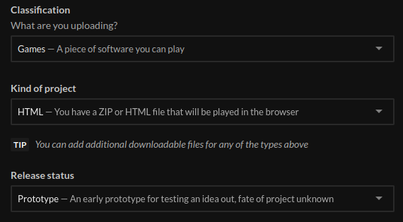
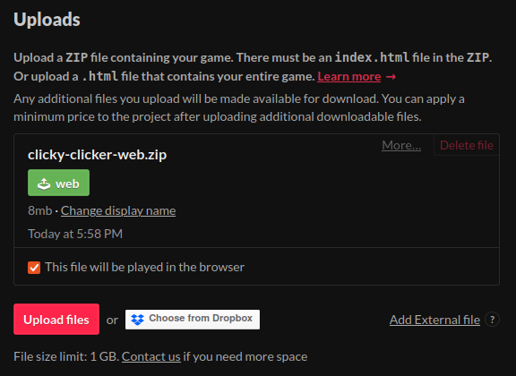
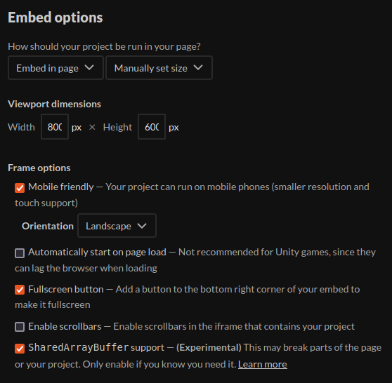

= godot-ci-template
:toc:

This is a Godot 4 template based on the excellent https://github.com/abarichello/godot-ci[abarichello/godot-ci] repository, with a number of enhancements:

* It's a template, so you can just instance it superfast 🚀
* It's optimized for web builds and GitHub Pages, though other platforms can be easily enabled in the GitHub Actions configuration.
* It runs builds and deploys in separate steps. It's configured so that the `deploy` steps are skipped on non-mainline branches.
* Uh, it comes with a _really_ spiffy ClickyClicker demo app I made in like, an hour. You can play it https://nanodeath.github.io/godot-ci-template/[here].

== Usage

1. Create a new repository from the template. Can be private or public, but GitHub Pages only works with public repositories (and Enterprise ones).
2. Delete the `clicky-clicker` directory and replace it with your own new Godot project. Update the corresponding environment variables at the top of link:.github/workflows/godot-ci.yml[.github/workflows/godot-ci.yml].
3. Replace the `LICENSE`.
4. Have fun!

== Setting up GitHub Pages

Example: https://nanodeath.github.io/godot-ci-template/

The GitHub template only sets up the actual repository for you and not any of the settings. To enable GitHub Pages, which you'll need if you want to play your web export on GitHub, you'll need  to do two things:

1. Ensure your repository is public. This is a bit unfortunate, but the cost of using GitHub I suppose. If not already a public repository, go to `Settings`, then at the bottom of the `General` subtab, click the red `Change visibility` button and change to public. 
2. Still on the `Settings` tab, go to the `Pages` subtab, then ensure you're publishing, `Source`: `Deploy from a branch`, `Branch`: `gh-pages` `/ (root)`.

You may need to push another change, but after that, you should be able to access your game at the URL at the top of the `Pages` subtab.

== Publishing to itch.io (assuming web)

Example: https://nanodeath.itch.io/clicky-clicker

1. Create your game (draft is fine) on itch.io.
2. Configure your game, at least setting `Kind of project` to `HTML`: 
+

+
3. Follow the directions https://itch.io/docs/butler/login.html[here] to get your itch.io Butler API key.
4. Follow the directions https://docs.github.com/en/actions/security-guides/using-secrets-in-github-actions[here] to create a GitHub secret in your repository called `BUTLER_API_KEY` containing the API key you got from the previous step. `New repository secret` is fine.
5. Update your link:.github/workflows/godot-ci.yml[godot-ci.yml] environment variables to at least refer to your itch.io project name.
6. Commit that, push it, and wait for it to succeed.
7. Once it succeeds, head back to your itch.io project page and ensure `This file will be played in the browser` is checked.
+

+
8. Finally, make sure your Embed options look like the following, especially the `SharedArrayBuffer support` setting:
+

+

And...that should be it.

== C#/Mono/.NET?

Godot 4, at least 4.2, https://docs.godotengine.org/en/stable/tutorials/export/exporting_for_web.html[doesn't support web], so that's left out of this template.
